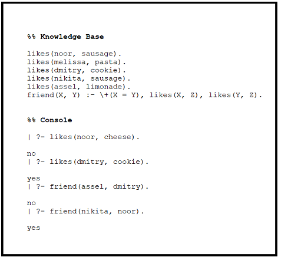

pytholog
================

## Prolog in Python

Python library that enables using prolog logic in
python. The aim of the library is to explore ways to use symbolic
reasoning with machine learning.

Now pytholog supports probabilities.

###### OR can be implemented with defining the rules as many times as the OR facts. For example, to say "fly(X) :- bird(X) ; wings(X)." can be defined as two rules as follows: "fly(X) :- bird(X)." and "fly(X) :- wings(X)."

#### prolog syntax



Prolog takes facts and rules. A fact or a rule has a predicate which in
“likes(noor, sausage)” is “likes” and in “friend(X, Y)” is “friend”.
Rules have “Left Hand Side (LHS)” which has a predicate and “Right Hand
Sides (RHS)” or “goals” to be searched to answer the queries about the
rules. LHS and RHS in a rule are separated with “:-”. Each predicate has
“Terms”. Prolog uses lowercased variables to describe “constant values”
and uppercased values to describe “variables” that need to be updated
from the query.

Let’s take an example: **likes(noor, sausage)** is a fact which has
**likes** as a predicate and **(noor and sausage)** as terms.
**friend(X, Y) :- +(X = Y), likes(X, Z), likes(Y, Z)** is a rule which
defines that two persons are considered friends if they like the same
dish. This rule has an LHS **friend(X, Y)** and RHS or goals **\[+(X =
Y), likes(X, Z), likes(Y, Z)\]**. The comma separating the goals means
**and** while **;** will mean **or**. Variables in the fact are
lowercased meaning they are truths and cannot change. While in a rule
they are Uppercased meaning they need to be changed while in a query.

Prolog uses **backtracking** search to answer the questions and the
queries.

I loved prolog and the idea of Symbolic Intelligence. So I decided to
build a module or a framework in python that can allow me to use prolog
inside python aiming to combine the power of machine learning and
symbolic reasoning.

#### pytholog Implementation

##### Installation

```bash
pip install pytholog
```

``` python
import pytholog as pl
```

#### Defining a knowledge base object to store the facts and rules.

``` python
new_kb = pl.knowledge_base("flavor")
new_kb(["likes(noor, sausage)",
        "likes(melissa, pasta)",
        "likes(dmitry, cookie)",
        "likes(nikita, sausage)",
        "likes(assel, limonade)",
        "food_type(gouda, cheese)",
        "food_type(ritz, cracker)",
        "food_type(steak, meat)",
        "food_type(sausage, meat)",
        "food_type(limonade, juice)",
        "food_type(cookie, dessert)",
        "flavor(sweet, dessert)",
        "flavor(savory, meat)",
        "flavor(savory, cheese)",
        "flavor(sweet, juice)",
        "food_flavor(X, Y) :- food_type(X, Z), flavor(Y, Z)",
        "dish_to_like(X, Y) :- likes(X, L), food_type(L, T), flavor(F, T), food_flavor(Y, F)"])
```

Let’s do some queries in this database using its facts and rules.

``` python
new_kb.query(pl.pl_expr("likes(noor, sausage)"))
# ['Yes']
```

``` python
new_kb.query(pl.pl_expr("likes(noor, pasta)"))
# ['No']
```

I added **Memoization** to speed up the queries.

###### Wikipedia definition: In computing, memoization or memoisation is an optimization technique used primarily to speed up computer programs by storing the results of expensive function calls and returning the cached result when the same inputs occur again.

Let’s test it doing the same query twice and compare time used to do the
query.

``` python
# query 1
from time import time
start = time()
print(new_kb.query(pl.pl_expr("food_flavor(What, sweet)")))
print(time() - start)

# [{'What': 'limonade'}, {'What': 'cookie'}]
# 0.0020236968994140625
```

``` python
# query 2
start = time()
print(new_kb.query(pl.pl_expr("food_flavor(Food, sweet)")))
print(time() - start)

# [{'Food': 'limonade'}, {'Food': 'cookie'}]
# 0.0
```

As you see, it took almost no time to return the same answer again and
it also takes care of different Uppercased variable inputs as they
anyways will be the same result no matter what they are.

Now we will use the **dish\_to\_like** rule to recommend dishes to
persons based on taste preferences.

``` python
start = time()
print(new_kb.query(pl.pl_expr("dish_to_like(noor, What)")))
print(time() - start)

# [{'What': 'gouda'}, {'What': 'steak'}, {'What': 'sausage'}]
# 0.001992940902709961
```

Let’s test the Memoization again:

``` python
start = time()
print(new_kb.query(pl.pl_expr("dish_to_like(noor, What)")))
print(time() - start)

# [{'What': 'gouda'}, {'What': 'steak'}, {'What': 'sausage'}]
# 0.0
```

##### City Coloring problem


###### Image Source: “Seven Languages in Seven Weeks” book.

The problem is **Constraint Satisfaction Problem**. The problem is to
color each city using only three colors but no adjacent cities can be
colored the same. The problem might seem so easy but it’s really
challenging how to tell this to a machine. But using prolog logic it is
kind of easier because all you have to do is to specify the rules of the
problem and prolog will answer.

``` python
## new knowledge base object
city_color = pl.knowledge_base("city_color")
city_color([
    "different(red, green)",
    "different(red, blue)",
    "different(green, red)", 
    "different(green, blue)",
    "different(blue, red)", 
    "different(blue, green)",
    "coloring(A, M, G, T, F) :- different(M, T),different(M, A),different(A, T),different(A, M),different(A, G),different(A, F),different(G, F),different(G, T)"
])
```

Let’s query the answer:

``` python
## we will use [0] to return only one answer 
## as prolog will give all possible combinations and answers
city_color.query(pl.pl_expr("coloring(Alabama, Mississippi, Georgia, Tennessee, Florida)"))[0]

# {'Alabama': 'blue',
#  'Mississippi': 'red',
#  'Georgia': 'red',
#  'Tennessee': 'green',
#  'Florida': 'green'}
```

Now let's try to play with some probabilities.
First in prolog **"is"** is used to assign the result of operations. 
For example, if we want to say "A = 3 * 4", we say "A is 3 * 4", not "A = 3 * 4" because this is unification not assignment.

Let's define some dummy knowledge base with probabilities and query them:
###### The numbers are totally dummy and have no meanings just to explain the functionality.

```python
battery_kb = pl.knowledge_base("battery")
battery_kb(["battery(dead,P) :- voltmeter(battery_terminals,abnormal,P2), P is P2 + 0.5",
			"battery(dead,P) :- electrical_problem(P), P >= 0.8",
			"battery(dead,P) :- electrical_problem(P2), age(battery,old,P3), P is P2 * P3 * 0.9",
			"electrical_problem(0.7)",
			"age(battery,old, 0.8)",
			"voltmeter(battery_terminals,abnormal,0.3)"])
			
battery_kb.query(pl.pl_expr("battery(dead, Probability)"))

# [{'Probability': 0.8}, {'Probability': 'No'}, {'Probability': 0.504}]
# the second one is "No" because the condition has not been met.
```
###### for another example of nested probabilities, see [friends_prob.md](/friends_prob.md)

Future implementation will try to come up with ideas to combine this
technique with **machine learning algorithms and neural networks**

**Contribution, ideas and any kind of help will be much appreciated**
